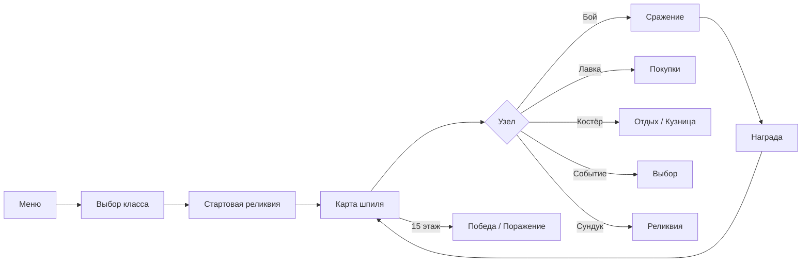

# Тени Шпиля

> **Эпический карточный рогалик в браузере** — восходи по шпилю, собирай колоду, сражайся с элитами и боссами, покоряй вершину.

Карточная roguelike-игра, вдохновлённая *Slay the Spire*: процедурная карта, пошаговые бои, реликвии, лавка, события и собственный редактор карт. Работает полностью в браузере, без сервера — прогресс и кастомные карты сохраняются в `localStorage`. Поддерживается установка как PWA.

---

## Содержание

- [Особенности](#особенности)
- [Быстрый старт](#быстрый-старт)
- [Скрипты](#скрипты)
- [Как играть](#как-играть)
- [Стек технологий](#стек-технологий)
- [Структура проекта](#структура-проекта)
- [Архитектура](#архитектура)
- [Данные и контент](#данные-и-контент)
- [PWA](#pwa)
- [Тестирование](#тестирование)
- [Лицензия](#лицензия)

---

## Особенности

### Игровой процесс

- **3 класса** — Воин, Плут и Страж с уникальными стартовыми колодами и стилем игры
- **15 этажей** процедурной карты с развилками: бои, элиты, боссы, костры, лавка, сундуки и события
- **Пошаговые бои** — энергия, блок, сила, уязвимость, намерения врагов, мульти-таргет и особые эффекты карт
- **70+ карт** шести типов: атака, блок, усиление, ослабление, добор, существо
- **15 реликвий** с пассивными эффектами — от стартовой брони до автоматического улучшения карт
- **9 врагов** — от культиста до финального стража, с уникальными паттернами намерений
- **5 случайных событий** с выбором и последствиями
- **Ежедневный забег** — общий seed дня для всех игроков, с отдельным рекордом этажа
- **Статистика и таблица лидеров** — забеги, победы, лучший этаж, убийства

### Мета и прогрессия

- Выбор стартовой реликвии перед забегом
- Награды после боя, лавка (карты, реликвии, удаление карт)
- Привал: лечение или кузница для улучшения карт
- Сундуки с реликвиями и случайные события на карте

### Редактор карт

Встроенный **редактор пользовательских карт**: создавайте атаки, навыки и силы, добавляйте их в пул наград и лавки. Кастомные карты хранятся локально в браузере.

### Интерфейс и UX

- Тёмная атмосферная тема с анимациями и звуковыми эффектами
- Плавные переходы между экранами, баннеры элит/боссов
- Просмотр колоды в любой момент забега
- Адаптивная вёрстка для десктопа и мобильных

---

## Быстрый старт

### Требования

- [Node.js](https://nodejs.org/) 18+ (рекомендуется 20 LTS)
- npm, pnpm или yarn

### Установка и запуск

```bash
git clone <url-репозитория>
cd OnlineCardGame
npm install
npm run dev
```

Откройте в браузере адрес, который выведет Vite (обычно `http://localhost:5173`).

### Production-сборка

```bash
npm run build
npm run preview
```

Статические файлы появятся в папке `dist/` — их можно развернуть на любом хостинге (GitHub Pages, Netlify, Vercel и т.д.).

---

## Скрипты

| Команда | Описание |
|---------|----------|
| `npm run dev` | Dev-сервер с hot reload |
| `npm run build` | Проверка TypeScript + production-сборка |
| `npm run preview` | Локальный просмотр production-сборки |
| `npm test` | Запуск unit-тестов (Vitest) |

---

## Как играть



1. **Новый забег** — выберите класс, затем одну из трёх стартовых реликвий.
2. **Карта** — кликайте по доступным узлам, двигаясь вверх по этажам.
3. **Бой** — тратьте энергию на карты, следите за намерениями врагов, завершайте ход кнопкой «Конец хода».
4. **После победы** — заберите золото и при желании добавьте карту в колоду.
5. **Цель** — дойти до 15-го этажа и победить финального босса.

**Ежедневный забег** использует общий seed на текущий день — удобно для сравнения результатов с друзьями.

---

## Стек технологий

| Слой | Технология |
|------|------------|
| UI | React 19, TypeScript 5.8 |
| Сборка | Vite 6 |
| PWA | vite-plugin-pwa (Workbox) |
| Тесты | Vitest 3 |
| Шрифты | Cinzel, Outfit (Google Fonts) |

Игровая логика — чистый TypeScript без внешних game-движков. Состояние забега управляется через React Context и reducer-подобные dispatch-действия.

---

## Структура проекта

```
OnlineCardGame/
├── public/              # Статика (favicon, PWA-иконки)
├── src/
│   ├── components/      # React-экраны и UI-компоненты
│   ├── data/            # JSON: карты, враги, реликвии
│   ├── game/            # Игровая логика (бой, карта, карты, RNG)
│   ├── hooks/           # useGame, useFx — состояние и эффекты
│   └── styles/          # Глобальные стили
├── index.html
├── vite.config.ts
├── tsconfig.json
└── package.json
```

---

## Архитектура

### Игровой движок (`src/game/`)

| Модуль | Назначение |
|--------|------------|
| `runState.ts` | Состояние забега, переходы между экранами |
| `combat.ts` | Пошаговый бой, ход игрока и врагов |
| `map.ts` | Генерация 15-этажной карты с развилками |
| `card.ts` / `cardEffects.ts` | Карты, эффекты, бонусы при розыгрыше |
| `player.ts` | HP, энергия, колода, рука, статусы |
| `enemy.ts` | Враги, намерения, элиты и боссы |
| `relic.ts` | Реликвии и их триггеры |
| `upgrade.ts` | Улучшение карт в кузнице |
| `rng.ts` | Детерминированный PRNG с seed |
| `stats.ts` | Статистика сессии в localStorage |
| `customCards.ts` | Пользовательские карты |
| `events.ts` | Случайные события на карте |
| `classes.ts` | Определения классов персонажей |

### UI (`src/components/`)

Экраны переключаются по полю `run.screen`: меню, карта, бой, лавка, награда, game over и др. Анимации и звук инкапсулированы в `useFx` и `sfx`.

---

## Данные и контент

Контент описан в JSON и легко расширяется:

- `src/data/cards.json` — карты и их параметры
- `src/data/enemies.json` — враги и паттерны намерений
- `src/data/relics.json` — реликвии
- `src/data/custom_cards.json` — шаблоны для редактора

Чтобы добавить новую карту, достаточно записи в `cards.json` с полями `id`, `name`, `type`, `cost`, `value`, `description`, `rarity`. Специальные эффекты задаются через `effect`, `bonuses`, `aoe`, `draw` и другие опциональные поля — см. тип `CardData` в `src/game/types.ts`.

---

## PWA

Приложение регистрируется как Progressive Web App:

- **Название:** Тени Шпиля
- **Тема:** `#06040f`
- **Режим:** standalone (можно «установить» на рабочий стол или домашний экран)

Offline-кэширование настраивается через Workbox в `vite.config.ts`. После деплоя production-сборки игра работает без интернета для уже загруженных ресурсов.

---

## Тестирование

```bash
npm test
```

Vitest покрывает ключевую логику:

- улучшение карт (`upgradeCard`)
- расчёт урона игрока (блок, уязвимость)
- детерминированность seeded RNG

Тесты лежат рядом с кодом: `src/game/game.test.ts`.

---

## Лицензия

[MIT](LICENSE) © 2026 Spirzen

---

<p align="center">
  <sub>Сделано с ⚔ для любителей deckbuilder roguelike</sub>
</p>
