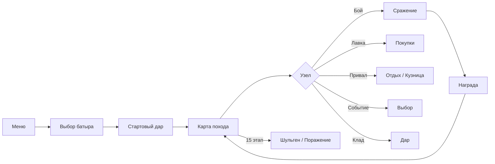

# Приключения Урала Батыра

> **Карточный рогалик по башкирскому эпосу «Урал-батыр»** — ищи Яншишму, собирай колоду, сражайся с дивами и аждахами, в финале встреть Шульгена — брата, выбравшего кровь вместо слова.

Браузерная roguelike-игра в духе *Slay the Spire*, но с полностью оригинальной оболочкой: герои, враги, карты, события и реликвии вплетены в сюжет башкирского эпоса «Урал-батыр» и романа «Бессмертная земля». У каждой карты, дара и встречи — развёрнутое описание с отсылками к Янбирде, Хумай, Самрау, Улему и роднику бессмертия.

Работает без сервера: прогресс и кастомные карты хранятся в `localStorage`. Поддерживается установка как PWA.

---

## Содержание

- [Особенности](#особенности)
- [Вселенная и сюжет](#вселенная-и-сюжет)
- [Быстрый старт](#быстрый-старт)
- [Скрипты](#скрипты)
- [Как играть](#как-играть)
- [Стек технологий](#стек-технологий)
- [Структура проекта](#структура-проекта)
- [Архитектура](#архитектура)
- [Данные и контент](#данные-и-контент)
- [PWA](#pwa)
- [Тестирование](#тестирование)
- [Лицензия](#лицензия)

---

## Особенности

### Игровой процесс

- **4 батыра** — Урал Батыр, Хумай, Акбузат и Янбирде; у каждого своя колода, цитата из эпоса и стиль игры
- **3 части эпоса** на карте из 15 этапов: *Янбирде и дети* → *Поиски Яншишмы* → *Наследие батыра*
- **Пошаговые бои** — энергия, блок, сила, уязвимость, яд, оглушение; намерения врагов; AOE и особые эффекты
- **76+ карт** с лор-текстами: *Удар сукмара*, *Гром Самрау*, *Капля Яншишмы*, *Коса Улема* и др.
- **15 даров** — Живая вода, Перо Хумай, Копыта Акбузата, Камень Урала…
- **12 врагов** — от приспешника Шульгена до **Шульгена** как финального босса
- **9 событий** — родник Яншишмы, лебедушка Хумай, конь Акбузат, голос Шульгена, совет зверей…
- **Ежедневный поход** — общий seed дня и отдельный рекорд
- **Статистика и топ батыров** — походы, победы, лучший этап, побеждённые враги

### Лор и тексты

- Описания карт, реликвий и врагов — по 4–6 предложений, с мотивами эпоса
- События — сцены с выбором и развёрнутыми итогами
- Тултипы карт и врагов в бою показывают полный текст без обрезки
- Встроенный роман «Бессмертная земля» (пролог + 10 глав) и кодекс эпоса — без внешних ссылок

### Мета и прогрессия

- Выбор стартового дара перед походом
- Награды после боя, лавка кочевника (карты, дары, удаление карт)
- Привал у костра: лечение или кузница батыра
- Клады с дарами и случайные встречи на тропе

### Редактор карт

Встроенный редактор пользовательских карт: создавайте атаки, навыки и силы и добавляйте их в пул наград и лавки. Кастомные карты хранятся локально.

### Интерфейс

- Степная палитра: золото, терракота, ночное небо
- Баннеры с именами элит и финального босса
- Просмотр колоды в любой момент похода
- Адаптивная вёрстка для десктопа и мобильных

---

## Вселенная и сюжет

Эпос «Урал-батыр» — башкирское сказание о семье Янбирде и Янбики, их сыновьях **Урале** и **Шульгене**, дочери царя птиц **Хумай**, космическом коне **Акбузате** и поисках **Яншишмы** — родника, способного победить **Улема** (Смерть).

В игре поход разбит на три части, как в эпосе:

| Часть | Этапы | Содержание |
|-------|-------|------------|
| I | 1–5 | Детство на затерянной земле, первые враги, встречи у костра |
| II | 6–10 | Царство дивов, тень Улема, аждахи |
| III | 11–15 | Путь к финалу и битва с **Шульгеном** |

**Играбельные батыры:**

| Батыр | Роль | Особенность колоды |
|-------|------|-------------------|
| Урал Батыр | Герой эпоса | Баланс ударов и защиты |
| Хумай | Дочь Самрау | Быстрый добор, хитрость |
| Акбузат | Космический конь | Толстая броня, сила |
| Янбирде | Мудрый старик | Исцеление и наставления |

---

## Быстрый старт

### Требования

- [Node.js](https://nodejs.org/) 18+ (рекомендуется 20 LTS)
- npm, pnpm или yarn

### Установка и запуск

```bash
git clone <url-репозитория>
cd OnlineCardGame
npm install
npm run dev
```

Откройте в браузере адрес, который выведет Vite (обычно `http://localhost:5173`).

### Production-сборка

```bash
npm run build
npm run preview
```

Статические файлы появятся в `dist/` — их можно развернуть на GitHub Pages, Netlify, Vercel и т.д.

---

## Скрипты

| Команда | Описание |
|---------|----------|
| `npm run dev` | Dev-сервер с hot reload |
| `npm run build` | Проверка TypeScript + production-сборка |
| `npm run preview` | Локальный просмотр production-сборки |
| `npm test` | Unit-тесты (Vitest) |
| `node scripts/expand-lore.mjs` | Перезаписать описания карт, врагов и реликвий из скрипта лора |

---

## Как играть



1. **Новый поход** — выберите батыра, затем один из трёх стартовых даров.
2. **Карта** — двигайтесь по этапам; над картой отображается текущая часть эпоса.
3. **Бой** — тратьте энергию на карты, смотрите намерения врагов (наведите на врага — увидите лор), завершайте ход кнопкой «Конец хода» или клавишей `E` / `У`.
4. **После победы** — золото и опционально новая карта в колоду.
5. **Цель** — пройти 15 этапов и победить **Шульгена**.

**Ежедневный поход** использует общий seed на текущий день — удобно сравнивать результаты с друзьями.

---

## Стек технологий

| Слой | Технология |
|------|------------|
| UI | React 19, TypeScript 5.8 |
| Сборка | Vite 6 |
| PWA | vite-plugin-pwa (Workbox) |
| Тесты | Vitest 3 |
| Шрифты | Cinzel, Outfit (Google Fonts) |

Игровая логика — чистый TypeScript без внешних game-движков. Состояние похода — React Context и dispatch-действия.

---

## Структура проекта

```
OnlineCardGame/
├── public/                 # favicon, PWA-иконки
├── scripts/
│   └── expand-lore.mjs     # Массовое обновление лор-описаний
├── src/
│   ├── components/         # Экраны и UI
│   ├── data/               # cards.json, enemies.json, relics.json
│   ├── game/               # Логика: бой, карта, карты, RNG, лор
│   │   ├── acts.ts         # Три части эпоса на карте
│   │   ├── epicTheme.ts    # Иконки карт, врагов, даров
│   │   ├── events.ts       # События на тропе
│   │   ├── classes.ts      # Батыры и стартовые колоды
│   │   └── locale.ts       # Все тексты интерфейса
│   ├── hooks/
│   └── styles/
├── index.html
├── vite.config.ts
└── package.json
```

---

## Архитектура

### Игровой движок (`src/game/`)

| Модуль | Назначение |
|--------|------------|
| `runState.ts` | Состояние похода, экраны, баннеры боя |
| `combat.ts` | Пошаговый бой |
| `map.ts` | Генерация 15-этажной карты |
| `card.ts` / `cardEffects.ts` | Карты и эффекты |
| `enemy.ts` | Враги, элиты; финал — Шульген |
| `relic.ts` | Дары и триггеры |
| `events.ts` | Случайные события с лором |
| `classes.ts` | Определения батыров |
| `acts.ts` | Названия и описания частей эпоса |
| `locale.ts` | Русская локализация |
| `epicTheme.ts` | Эмодзи-арты и иконки |
| `rng.ts` | Детерминированный PRNG с seed |
| `stats.ts` | Статистика в localStorage |

### UI (`src/components/`)

Экраны переключаются по `run.screen`: меню, выбор батыра, карта, бой, лавка, награда, game over и др.

---

## Данные и контент

| Файл | Содержание |
|------|------------|
| `src/data/epic-novel.txt` | Роман «Бессмертная земля» — пролог и 10 глав (~280 тыс. знаков) |
| `src/data/cards.json` | 76+ карт с `name`, `description` (лор), механиками |
| `src/data/enemies.json` | 26+ врагов (мифические и элиты), включая Шульгена |
| `src/data/relics.json` | 15 даров |
| `src/data/custom_cards.json` | Шаблоны редактора |
| `src/game/codex.ts` | 26 статей кодекса (эпос, герои, места, духи) |
| `src/game/events/` | ~130 текстовых событий с лором |

Новая карта — запись в `cards.json` с полями `id`, `name`, `type`, `cost`, `value`, `description`, `rarity`. Эффекты: `effect`, `bonuses`, `aoe`, `draw` и др. — см. `CardData` в `src/game/types.ts`.

Чтобы массово обновить лор-описания, отредактируйте объекты в `scripts/expand-lore.mjs` и выполните:

```bash
node scripts/expand-lore.mjs
```

---

## PWA

- **Название:** Приключения Урала Батыра
- **Короткое имя:** Урал Батыр
- **Тема:** `#0a0806`
- **Режим:** standalone — можно установить на рабочий стол или домашний экран

Offline-кэш через Workbox в `vite.config.ts`.

---

## Тестирование

```bash
npm test
```

Vitest покрывает улучшение карт, расчёт урона и seeded RNG (`src/game/game.test.ts`).

---

## Лицензия

[MIT](LICENSE) © 2026 Spirzen

---

<p align="center">
  <sub>⚔ Ищи Яншишму. Сразись с дивами. Спаси землю.</sub>
</p>
